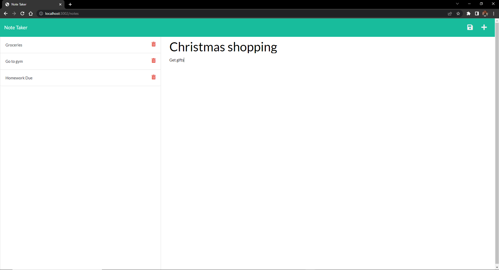

# note-taker

## Description

This note taker project was created in order to take and ave notes easily while storing them in a database to reference at a later date. I built this project to become familiar with express.js while practice using insomnia and heroku to work with/deploy a back-end application. This application can be used to help people log to-dos or to save information in the form of a note. I learned about pathing with express.js as well as utilizing dynamic properties on an html page using node.js and javascript.

## Usage

Screenshot:

